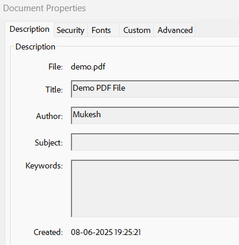
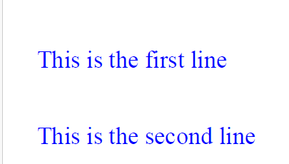
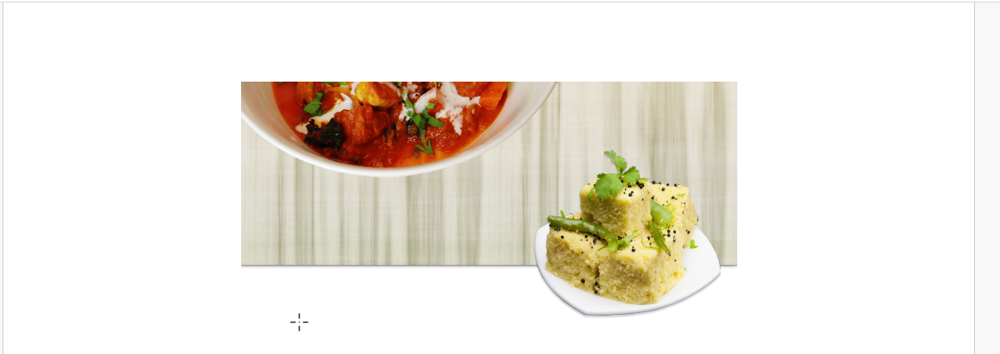
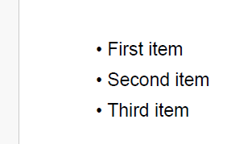
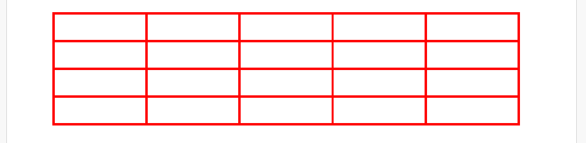
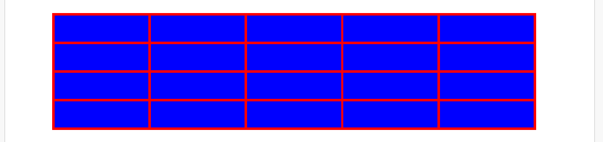
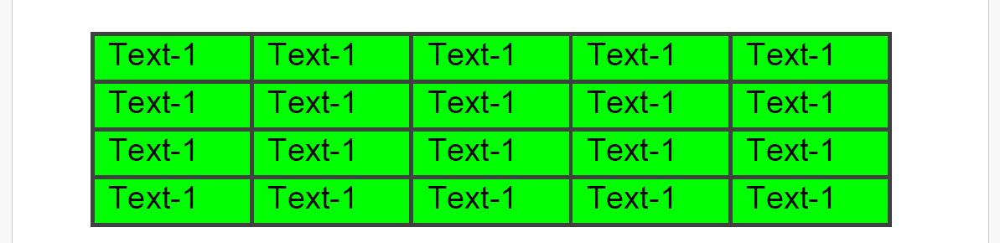

# PDF Box Library

## Create PDF
To create pdf we need only few line of code. This will create a empty pdf file.
```java
import org.apache.pdfbox.pdmodel.PDDocument;
import org.apache.pdfbox.pdmodel.PDPage;

import java.io.IOException;

public class PDFDemo {
    public static void main(String[] args) throws IOException {
        PDDocument document = new PDDocument();
        PDPage firstPage = new PDPage(PDRectangle.A4);
        document.addPage(firstPage);

        document.save("demo.pdf"); // This will create a pdf file in root project.
//        document.save("C:\\Users\\Lenovo\\Desktop\\demo.pdf"); // This will create a pdf file in Desktop.
        document.close();
        System.out.println("PDF created!");
    }
}
```

## Add Document properties
```java
    // Add PDF Properties
    PDDocumentInformation docInfo = document.getDocumentInformation();
    docInfo.setAuthor("Mukesh");
    docInfo.setTitle("Demo PDF File");
    docInfo.setCreationDate(Calendar.getInstance());
``` 


## Add text to pdf
```java
    PDDocument document = new PDDocument();
    PDPage firstPage = new PDPage();
    document.addPage(firstPage);
    int pageWidth = (int) firstPage.getTrimBox().getWidth();
    int pageHeight = (int) firstPage.getTrimBox().getHeight();
    log.info("Page width:{} and height:{}", pageWidth, pageHeight);

    // add text to pdf
    PDFont fontRoman = new PDType1Font(Standard14Fonts.FontName.TIMES_ROMAN);
    PDPageContentStream contentStream = new PDPageContentStream(document, firstPage);
    contentStream.beginText();;
    contentStream.setFont(fontRoman, 18);
    contentStream.setLeading(56.0f);// space between two line of text
    // Page will always start from bottom left corner(x = 0, y = 0)
    contentStream.newLineAtOffset(25, pageHeight - 50); // coordinate from where text will start.
    contentStream.setNonStrokingColor(Color.BLUE); // Set the text color
    contentStream.showText("This is the first line");
    contentStream.newLine();
    contentStream.showText("This is the second line");
    contentStream.endText();
    contentStream.close();
```

## Add Image to PDF
```java
    PDPageContentStream contentStream = new PDPageContentStream(document, firstPage);

    // Add image
    PDImageXObject headImage = PDImageXObject.createFromFile("src/main/resources/img/Indian Tadka head.png", document);
    contentStream.drawImage(headImage, 150, pageHeight - 200, pageWidth - 300, 150);

    contentStream.close();
```


## Add bullet list
PDFBox doesn't have built-in bullet list support like HTML or word processors.
```java
    PDPageContentStream contentStream = new PDPageContentStream(document, firstPage);
    PDFont font = new PDType1Font(Standard14Fonts.FontName.HELVETICA);
    // Add bullet list
    contentStream.beginText();
    contentStream.setFont(font, 12);
    contentStream.setLeading(20f); // Line spacing
    contentStream.newLineAtOffset(50, 700); // Start position

    List<String> items = List.of("First item", "Second item", "Third item");

    for (String item : items) {
        contentStream.showText("\u2022 " + item); // Unicode bullet character
        contentStream.newLine();
    }
    contentStream.endText();
    contentStream.close();
```
There is other way also where 1st we will add our custom font which we will use the create the bullet.


## create table with outline
No any inbuilt library to create table.
```java
    PDPageContentStream contentStream = new PDPageContentStream(document, firstPage);
    contentStream.setStrokingColor(Color.RED);
    contentStream.setLineWidth(2);

    int cellHeight = 30;
    int cellWidth = 100;
    int x = 50;
    int y = pageHeight - 50;
    int xInitial = x;
    int colCount = 5;
    int rowCount = 4;

    for (int i = 1; i <= rowCount; i++) {
        for (int j = 1; j <= colCount; j++) {
            // As we are moving from top to bottom so cell height will be -ve.
            contentStream.addRect(x, y, cellWidth, -cellHeight);
            x = x + cellWidth;
        }
        x = xInitial;
        y = y - cellHeight;
    }
    contentStream.stroke();  // For outline
    contentStream.close();
```


## Create table with background color
```java
    PDPageContentStream contentStream = new PDPageContentStream(document, firstPage);
    contentStream.setStrokingColor(Color.RED);
    contentStream.setNonStrokingColor(Color.BLUE);
    contentStream.setLineWidth(2);

    int cellHeight = 30;
    int cellWidth = 100;
    int x = 50;
    int y = pageHeight - 50;
    int xInitial = x;
    int colCount = 5;
    int rowCount = 4;uyy7y

    for (int i = 1; i <= rowCount; i++) {
        for (int j = 1; j <= colCount; j++) {
            // As we are moving from top to bottom so cell height will be -ve.
            contentStream.addRect(x, y, cellWidth, -cellHeight);
            x = x + cellWidth;
        }
        x = xInitial;
        y = y - cellHeight;
    }
//        contentStream.stroke(); // For outline
        contentStream.fillAndStroke(); // For fill the cell with color and outline
    contentStream.close();
```


## Table with cell content
```java
    PDFont font = new PDType1Font(Standard14Fonts.FontName.HELVETICA);
    PDPageContentStream contentStream = new PDPageContentStream(document, firstPage);
    // add table
    int cellHeight = 30;
    int cellWidth = 100;
    int x = 50;
    int y = pageHeight - 50;
    int xInitial = x;
    int colCount = 5;
    int rowCount = 4;
    
    for (int i = 1; i <= rowCount; i++) {
        for (int j = 1; j <= colCount; j++) {
            contentStream.setStrokingColor(Color.DARK_GRAY);
            contentStream.setNonStrokingColor(Color.GREEN);
            contentStream.setLineWidth(2);
            // As we are moving from top to bottom so cell height will be -ve.
            contentStream.addRect(x, y, cellWidth, -cellHeight);
            contentStream.fillAndStroke(); // For fill the cell with color and outline
            contentStream.beginText();
            contentStream.setNonStrokingColor(Color.BLACK);
            contentStream.newLineAtOffset(x + 10, y - cellHeight + 10);
            contentStream.setFont(font, 20);
            contentStream.showText("Text-1");
            contentStream.endText();
    
            x = x + cellWidth;
        }
        x = xInitial;
        y = y - cellHeight;
    }
    
    contentStream.close();
```


# Git command
## …or create a new repository on the command line
```
echo "# PDFGenerator" >> README.md
git init
git add README.md
git commit -m "first commit"
git branch -M main
git remote add origin https://github.com/MukeshKumarSuman/PDFGenerator.git
git push -u origin main
```
## …or push an existing repository from the command line
```
git remote add origin https://github.com/MukeshKumarSuman/PDFGenerator.git
git branch -M main
git push -u origin main
```